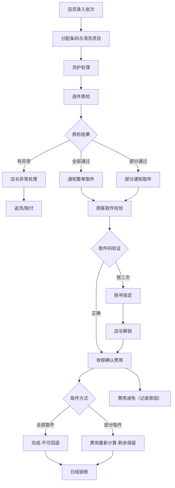

## 1. 产品概述

洗衣店衣物批次、质检、取件码与超期计费管理系统，面向现代连锁洗衣店运营场景，覆盖店员、顾客、店长、收银四类角色，实现从衣物入店到取件结账的全流程数字化管理。系统支持衣物条码扫描、质检异常处理、取件码安全校验、超期保管自动计费、部分取件费用重算、返洗赔付处理、门店调拨、会员折扣套餐、日结锁账等核心业务功能。

### 2. 核心功能

#### 2.1 用户角色

| 角色 | 认证方式 | 核心权限 |
|------|---------|---------|
| 店员 | 工号/密码 | 录入衣物批次、衣物明细、清洗项目、预计完成时间、质检结果、异常照片；扫码、批次拆分 |
| 顾客 | 手机号/取件码 | 查看可取衣物、取件码校验、代取授权 |
| 店长 | 工号/密码 | 处理质检异常、超期未取、费用调整、锁定解除、返洗审批、赔付审批、门店调拨、日结锁账、审计日志 |
| 收银 | 工号/密码 | 确认取件收费、费用试算、减免记录、部分取件、日结对账 |

#### 2.2 功能模块

1. **批次列表页**：批次创建、扫码录入、批次拆分、状态跟踪、明细查看
2. **质检看板页**：待质检列表、质检结果录入、异常照片、颜色风险、贵重估值、部分质检
3. **取件校验页**：手机号/取件码查询、可取衣物展示、三次错码锁定、解锁申请
4. **超期收费页**：超期批次列表、保管期计费、自动计费规则、超期通知
5. **异常处理页**：质检异常处理、返洗处理、赔付审批、费用调整、锁定解锁审计
6. **收银确认页**：取件确认、费用试算、部分取件、会员折扣、套餐价格、费用减免（带原因）、日结锁账
7. **调拨外包页**：门店调拨、外包洗护、代取授权

#### 2.3 页面详情

| 页面名称 | 模块名称 | 功能描述 |
|---------|---------|-----------|
| 批次列表 | 批次表格 | 批次流水号、顾客信息、衣物数量、状态、预计时间、操作列 |
| 批次列表 | 批次详情面板 | 衣物明细、清洗项目、价格、条码、颜色风险、贵重估值、状态 |
| 批次列表 | 批次创建弹窗 | 顾客信息、衣物录入（支持扫码）、清洗项目选择、预计完成时间 |
| 批次列表 | 批次拆分弹窗 | 选择要拆分的衣物、生成新批次号 |
| 质检看板 | 待质检列表 | 按批次分组、衣物列表、质检状态标签 |
| 质检看板 | 质检操作面板 | 通过/失败/异常、异常描述、照片占位、颜色风险标记、贵重估值 |
| 质检看板 | 部分通知 | 选择质检通过的衣物、发送取件通知 |
| 取件校验 | 查询区域 | 手机号输入、取件码输入、提交按钮 |
| 取件校验 | 可取衣物列表 | 批次号、衣物列表、质检状态、取件按钮 |
| 取件校验 | 锁定提示 | 错码次数、剩余次数、已锁定提示 |
| 超期收费 | 超期批次列表 | 批次号、取件码、应取件日期、超期天数、保管费用、操作 |
| 超期收费 | 计费规则配置 | 免费保管天数、日保管费率、阶梯费率 |
| 异常处理 | 异常列表 | 质检异常、返洗申请、赔付申请、锁定记录、费用变更 |
| 异常处理 | 返洗处理 | 选择衣物、返洗原因、重新入批次 |
| 异常处理 | 赔付审批 | 申请金额、审批金额、赔付原因、审批意见 |
| 异常处理 | 锁定解锁审计 | 锁定记录列表、解锁操作、操作日志 |
| 收银确认 | 取件收费列表 | 待取件批次、衣物明细、基础费用、超期费用、折扣、应付 |
| 收银确认 | 费用试算弹窗 | 选择部分衣物、计算费用、对比全额 |
| 收银确认 | 减免弹窗 | 减免金额、减免原因（必填）、减免人 |
| 收银确认 | 日结对账 | 当日收入明细、已结/未结批次、锁账操作 |
| 调拨外包 | 门店调拨 | 调出/调入门店、衣物列表、运输状态 |
| 调拨外包 | 外包洗护 | 外包商、衣物列表、发出/收回时间 |
| 调拨外包 | 代取授权 | 授权人手机号、被授权人信息、有效期 |

### 3. 核心流程

#### 3.1 主业务流程

店员录入衣物批次 → 分配条码与清洗项目 → 洗护处理 → 逐件质检（支持部分通过/失败）→ 仅质检通过的可通知取件 → 顾客凭手机号/取件码取件 → 错码三次锁定 → 收银确认费用（含超期保管费、会员折扣、套餐价格、减免）→ 支持部分取件（费用重算）→ 已取走批次不可回退 → 日结锁账

### 4. 用户界面设计

#### 4.1 设计风格

采用**工业专业风格**，适合 B 端管理系统场景：
- **主色**：深蓝 `#0F2744`（专业可靠）
- **强调色**：琥珀橙 `#F59E0B`（警示、操作）、翠绿 `#10B981`（通过）、珊瑚红 `#EF4444`（异常/失败）
- **中性色**：石板灰系列 `#0F172A / #334155 / #64748B / #CBD5E1 / #F1F5F9`
- **按钮风格**：方角微圆（4px）、2px 边框描边、悬停上移阴影
- **字体**：标题使用 "Noto Serif SC" 衬线体（典雅专业），正文使用 "Noto Sans SC" 无衬线体
- **布局风格**：左侧导航栏 + 顶部状态栏 + 主内容卡片网格，数据密集型表格为主
- **图标风格**：Lucide 线性图标，尺寸统一 18px

#### 4.2 页面设计概述

| 页面名称 | 模块名称 | UI元素 |
|---------|---------|--------|
| 批次列表 | 批次表格 | 斑马行表格、状态标签（彩色描边）、行悬停高亮、操作下拉菜单 |
| 批次列表 | 详情抽屉 | 右侧滑出、衣物卡片网格、时间线状态流 |
| 质检看板 | 衣物卡片流 | 瀑布式卡片、质检状态角标、颜色风险色条、贵重标识 |
| 质检看板 | 质检侧栏 | 大尺寸状态按钮、异常文本域、照片占位网格 |
| 取件校验 | 查询区 | 大输入框、双选项卡（手机号/取件码）、提交按钮带加载动画 |
| 超期收费 | 计费卡片 | 数据指标卡、超期天数进度条、阶梯费率可视化 |
| 异常处理 | 审批流 | 待办卡片堆叠、审批按钮组、时间线日志 |
| 收银确认 | 费用计算 | 数字大号显示、费用项列表、计算动画、减免输入带原因必填 |
| 日结对账 | 锁账面板 | 汇总数据、锁定状态指示、解锁需双人确认交互 |

#### 4.3 响应式

桌面端优先设计（1280px 起），平板自适应（表格横向滚动），移动端仅保留取件校验查询页简化视图。所有操作按钮在触控设备上增大至 44px 最小点击区域。
