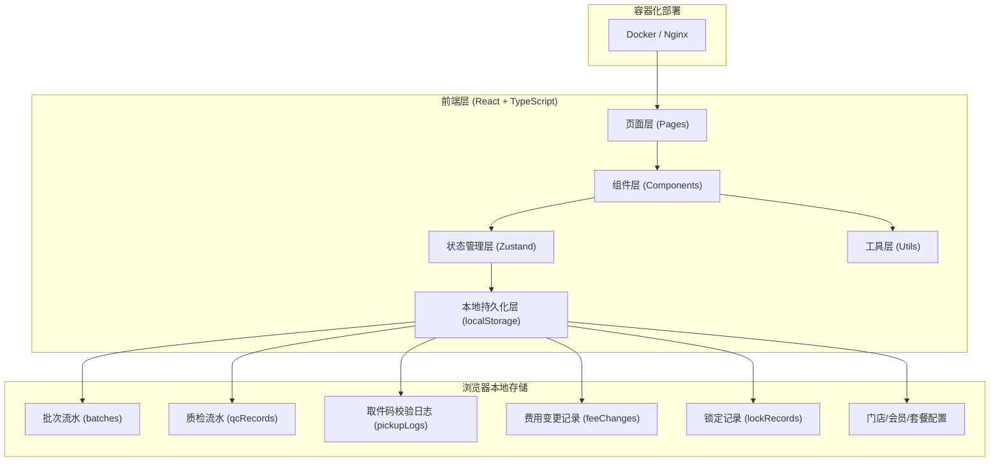
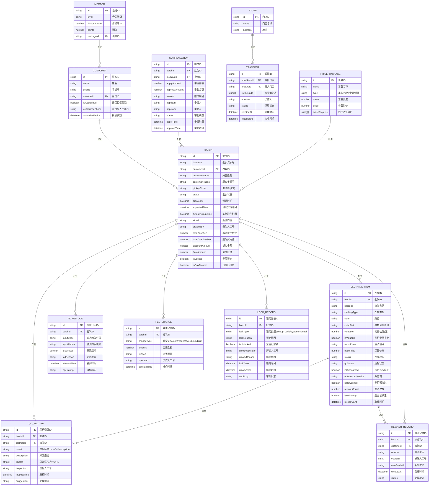

## 1. 架构设计



## 2. 技术描述

- **前端框架**：React@18 + TypeScript
- **构建工具**：Vite
- **样式方案**：Tailwind CSS 3
- **状态管理**：Zustand（含 persist 中间件持久化到 localStorage）
- **路由方案**：React Router DOM
- **图标库**：Lucide React
- **后端**：无（纯前端应用，所有数据存储在浏览器 localStorage）
- **容器化**：Dockerfile + nginx.conf 支持部署

## 3. 路由定义

| 路由 | 页面 | 说明 |
|------|-----|------|
| / | 角色选择页 | 入口，选择店员/顾客/店长/收银角色 |
| /login | 登录页 | 工号/密码登录，或顾客手机号/取件码 |
| /batches | 批次列表页 | 店员/店长可见，批次CRUD、扫码、拆分 |
| /qc | 质检看板页 | 店员/店长可见，衣物质检、异常处理 |
| /pickup | 取件校验页 | 顾客/收银可见，手机号/取件码查询 |
| /overdue | 超期收费页 | 店长/收银可见，超期计费管理 |
| /exceptions | 异常处理页 | 店长可见，质检异常、返洗、赔付、解锁审计 |
| /cashier | 收银确认页 | 收银可见，取件收费、费用试算、减免、日结 |
| /transfer | 调拨外包页 | 店长可见，门店调拨、外包、代取授权 |

## 4. 数据模型

### 4.1 数据模型 ER 图



### 4.2 状态聚合计算规则

批次状态由以下数据源汇总计算得出：
1. 所有衣物明细的 `status` 和 `qcStatus`
2. 所有 `QC_RECORD` 质检结果
3. 所有 `FEE_CHANGE` 费用流水（含超期、折扣、减免）
4. `PICKUP_LOG` 取件码校验结果与错误次数
5. `LOCK_RECORD` 锁定记录

状态流转：
- `PENDING_QC`（待质检）：有衣物未完成质检
- `QC_PARTIAL`（部分质检）：部分衣物通过，部分未质检/失败
- `QC_FAILED`（质检异常）：存在质检失败且未处理的衣物
- `READY`（待取件）：全部质检通过且未锁定
- `OVERDUE`（超期）：超过预计完成时间 + 免费保管期
- `PARTIAL_PICKED`（部分取走）：部分衣物已取走，且该部分不可回退
- `COMPLETED`（已完成）：全部衣物已取走且已日结
- `LOCKED`（已锁定）：存在有效锁定记录

### 4.3 核心业务规则约束

1. **质检完整性约束**：未完成全部质检的批次不允许发送取件通知
2. **部分质检约束**：任意一件衣物质检失败，不允许整单标记完成；仅可通知已通过的衣物
3. **取件码安全约束**：同一取件码连续输入错误 3 次自动锁定，记录到 LOCK_RECORD
4. **超期计费规则**：超过预计完成时间 N 天后（可配置）自动按日计算保管费，支持阶梯费率
5. **部分取件重算**：顾客部分取件时，重新计算剩余衣物的费用分摊，已取部分不可回退
6. **已取走不可回退**：`isPickedUp=true` 的衣物不允许任何状态回退操作
7. **费用减免审计**：所有减免操作必须填写 `reason` 原因字段，不能为空
8. **日结锁账**：日结后该批次所有记录不可修改，解锁需店长+收银双人确认

## 5. 项目结构

```
src/
├── components/          # 可复用组件
│   ├── layout/          # 布局组件（侧边栏、顶栏）
│   ├── ui/              # 基础UI组件（按钮、标签、表格、模态框）
│   ├── batch/           # 批次相关组件
│   ├── qc/              # 质检相关组件
│   ├── pickup/          # 取件相关组件
│   ├── cashier/         # 收银相关组件
│   └── common/          # 通用业务组件
├── pages/               # 页面组件
│   ├── Login.tsx
│   ├── BatchList.tsx
│   ├── QualityControl.tsx
│   ├── PickupVerify.tsx
│   ├── OverdueCharge.tsx
│   ├── ExceptionHandle.tsx
│   ├── CashierConfirm.tsx
│   └── TransferOutsource.tsx
├── store/               # Zustand 状态管理
│   ├── useBatchStore.ts     # 批次与衣物状态
│   ├── useQcStore.ts        # 质检状态
│   ├── usePickupStore.ts    # 取件与锁定状态
│   ├── useCashierStore.ts   # 收银与费用状态
│   └── useAuthStore.ts      # 角色与认证状态
├── types/               # TypeScript 类型定义
│   ├── batch.ts
│   ├── qc.ts
│   ├── pickup.ts
│   ├── fee.ts
│   └── index.ts
├── utils/               # 工具函数
│   ├── statusCalc.ts    # 批次状态聚合计算
│   ├── feeCalc.ts       # 费用计算（含超期、折扣、重算）
│   ├── codeGen.ts       # 取件码、条码生成
│   ├── dateUtil.ts      # 日期工具
│   ├── mockData.ts      # 演示数据生成
│   └── storage.ts       # localStorage 封装
├── hooks/               # 自定义 Hooks
│   ├── useStatusAgg.ts  # 状态聚合计算 Hook
│   ├── useFeeCalc.ts    # 费用计算 Hook
│   └── usePickupLock.ts # 取件锁定 Hook
├── App.tsx
├── main.tsx
└── index.css
```

## 6. 本地数据演示场景

系统内置演示数据，可直接演示以下场景：
1. **质检失败场景**：批次 B20240101001 中衣物 C003 质检失败，不允许整单完成
2. **错码锁定场景**：取件码 123456 连续输错 3 次，批次自动锁定
3. **超期计费场景**：批次 B20240101002 超期 7 天，自动计算 35 元保管费
4. **部分取件重算场景**：批次 B20240101003 中 2 件取走、1 件保留，费用按比例分摊重算
5. **减免冲正场景**：收银对某批次减免 20 元，记录原因为"老客户补偿"，可冲正
6. **已取走禁止回退场景**：衣物 C001 已取走，尝试回退状态时被拦截并提示不可操作
